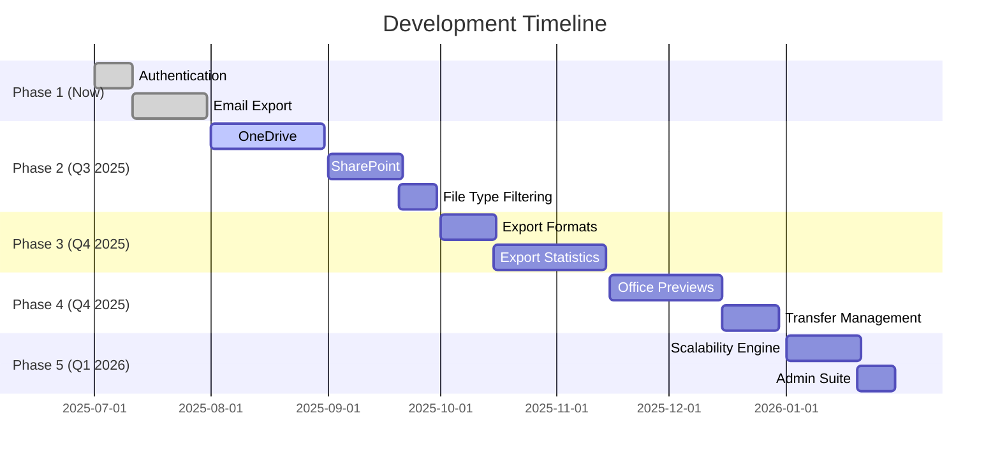
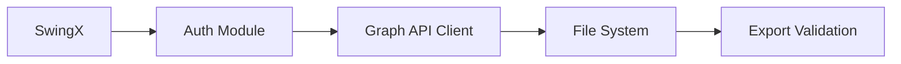

# Azure Data Guardian  
**Enterprise Azure Data Management Suite (Phase 1)**  

> **Phase 1**: Secure email management solution for Azure administrators. A comprehensive data management suite evolving through planned releases.

---

## 🚀 Phase 1: Core Foundation (Available Now)

### 🔐 Secure Authentication
- Desktop UI for Azure credential input (Tenant ID, Client ID, Client Secret)
- Microsoft Graph API integration with OAuth 2.0
- Permission validation and error handling

### ✉️ Email Data Management
- Full mailbox processing via Microsoft Graph API
- User selection interface for targeted exports
- Raw EML format export with metadata preservation

### 🖥️ Standalone Desktop Application
- Java JAR executable (Java 17+ required)
- Intuitive desktop UI (SwingX)

**Phase 1 UI Preview**:  
  
*Current interface showing authentication and email export workflow*

---

## 🔮 Future Release Roadmap

### Phase 2: Search & Expand (Q3 2025)
- **OneDrive Integration**: Business file management and export
- **SharePoint Access**: Document library retrieval
- **File Type Filtering**: Selective exports (e.g., ".docx only")

### Phase 3: Advanced Operations (Q4 2025)
- **Multi-Format Exports**: CSV, JSON, XML metadata reports
- **ZIP Compression**: Archive creation options
- **Export Statistics**: Performance metrics dashboard

### Phase 4: Enterprise Readiness (Q1 2026)
- **Office Previews**: Native Word/Excel/PPT viewing
- **Transfer Reliability**: Pause/resume functionality
- **Progress Tracking**: Real-time export monitoring
- **Bulk Operations**: Multi-user/data source processing

### Phase 5: Optimization & Scale (Q1 2026)
- **Distributed Processing**: High-volume handling
- **Azure Blob Integration**: Cloud storage options
- **Scheduled Backups**: Automated export workflows

---

## ⚡ Getting Started with Phase 1

### Prerequisites
- Java 17+ Runtime ([Download](https://java.com))
- Azure AD App Registration with:
  - `Mail.Read` permission
  - Admin consent granted
- Valid admin credentials (Tenant ID, Client ID, Client Secret)

### First-Time Workflow
1. Enter Azure credentials in authentication screen
2. Navigate to "Email Management" tab
3. Select target user mailbox
4. Initiate export (saves as EML files to local directory)

---

## 💼 Phase 1 Use Case: Email Archive Migration

**Scenario**: Export emails from departed employee `j.smith@company.com` for legal retention

**Workflow**:
1. Launch application and authenticate
2. Select "Email Export" module
3. Enter target email address
4. Export full mailbox as EML files
5. Preserve original folder structure

**Key Benefits**:
- No PowerShell expertise required
- Native format preservation for compliance
- Desktop-based secure processing

---

## 🛠️ Technical Specifications (Phase 1)

### Architecture

### Supported Environments
- Windows 10/11 (64-bit)
- macOS 12+ (Intel/Apple Silicon)
- Linux (Ubuntu 20.04+, Fedora 36+)

---

## 📬 What's Next in Phase 2?
- OneDrive business data management
- SharePoint document access
- File type filtering capabilities

**Contribute to our roadmap**:  

---

## 🧪 Testing & Feedback
We invite administrators to:
1. Validate authentication workflows
2. Test email export integrity
3. Suggest UI improvements

---

## 🤝 Contribution Guidelines
1. Fork the repository
2. Create feature branch (`git checkout -b feature/your-feature`)
3. Commit changes (`git commit -m 'Add amazing feature'`)
4. Push to branch (`git push origin feature/your-feature`)
5. Open pull request

**Priority Contribution Areas**:
- Graph API error handling
- Export performance optimization
- UI test automation
- Localization framework

---

## 📜 License  
MIT License 

**Security Reports**: [kien61365@gmail.com](mailto:kien61365@gmail.com)  

---

**Join Our Evolution**:  
⭐ **Star this repo to stay updated on new releases** ⭐  

---

> "The journey of a thousand backups begins with a single export." - Phase 1 Motto
